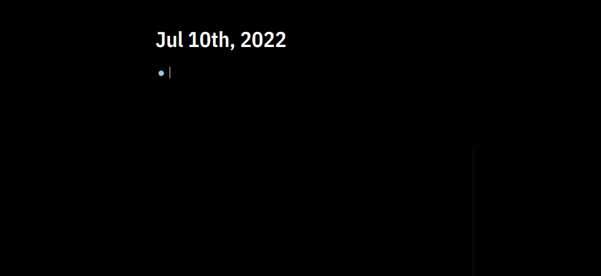

## Logseq Plugin Automatic URL title

#### :warning: Alert: I won't maintain this repo anymore. I consider it comple it because it fulfills the requirements that I need. If you need an additional feature or bug to be fixed please feel free to fork the repo and go crazy with it. Thank you :)

Automatically fetches the title of a website and wraps it into markdown link format. Also, renders the favicon of the url next to it.



To disable the favicon, override the `--favicons` variable.

```css
:root {
  --favicons: none;
}
```

## Credits

- https://github.com/sawhney17/logseq-automatic-linker
- https://github.com/zolrath/obsidian-auto-link-title
- https://github.com/yoyurec/logseq-solarized-extended-theme

## License

[MIT License](./LICENSE)
